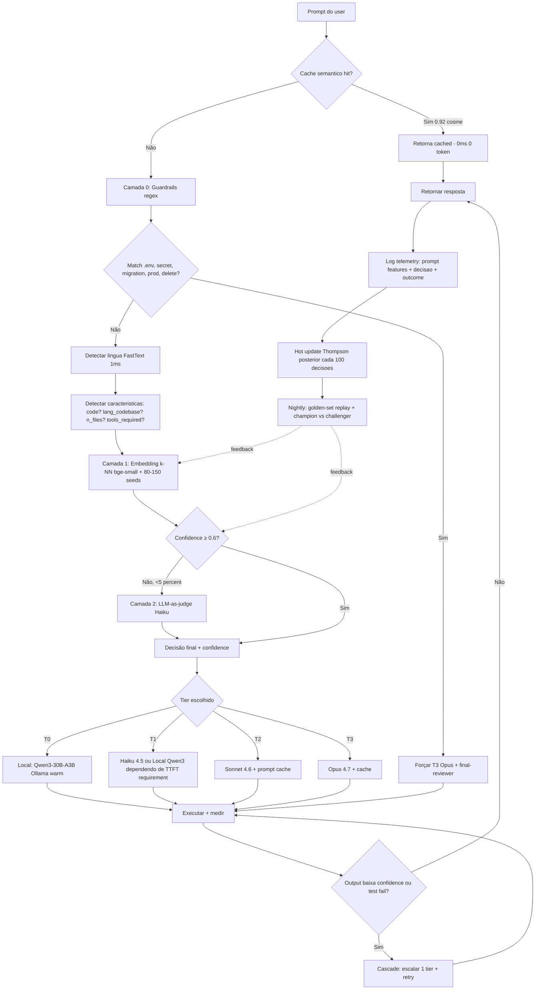

# MOOTER — Fluxograma Definitivo (V3)
**Análise estratégica · 2026-05-07 · double-check do double-check**
**Documento auto-suficiente — substitui V1+V2 quando tiveres a versão definitiva da arquitectura. Lê V1 e V2 para contexto histórico.**

---

## 0. TL;DR — 4 conclusões honestas

1. 🔥 **Redução de custo realista vs all-Opus baseline: 65–82%** sem perda significativa de qualidade — desde que a classificação seja boa. Não é os 95% que blogs prometem; é o que produção mostra empiricamente (RouteLLM 85% em MT-Bench, na prática 65–80% em workloads heterogéneos com modelos frontier mais novos onde o gap diminuiu).

2. ⚠️ **Tempo é perdido em local em outputs curtos (<200 tokens), ganho em outputs longos (>2000)**. TTFT do qwen3-30B Q4 no RTX 4090 é **4.6s**; Haiku 4.5 é **0.7s**. Para commit msgs, local é 3–4× mais lento em wall-time. Para refactor de 3000 tokens, local empata ou bate Sonnet. **Cold start mata** — `OLLAMA_KEEP_ALIVE=24h` é obrigatório.

3. 🔥 **A regra-mãe de routing não é "tamanho do diff" — é forma da task**. Schema bem-definido + entropia baixa (regex, JSON, commit, docstring) → T0/T1 local/Haiku **mesmo em refactors grandes**. Reasoning multi-passo OU >3 ficheiros OU policy adherence → T2/T3 frontier. Esta é a heurística mais robusta de toda a literatura 2026.

4. 🔥 **Auto-melhoria converge em ~10k decisões, não overnight**. Phase 0: ε-greedy + k-NN seed. Phase 1 (após 1k): Thompson sampling. Phase 2 (após 10k): LinUCB com embeddings. Champion-challenger shadow routing 100% do tráfego desde dia 1.

---

## 1. Fluxograma definitivo — pipeline de uma decisão



**Trace narrativo de uma decisão (commit msg em PT-BR, codebase EN):**
1. Cache semântico → miss
2. Regex guardrails → no match (commit msg é benigno)
3. FastText detect → `pt-BR`
4. Feature extract → `{has_code: false, codebase_lang: en, n_tokens_in: 80, n_files: 0, tools: false}`
5. Embedding k-NN → 5 vizinhos rotulados, 4/5 são T1, confidence 0.83
6. Tier T1 → Haiku 4.5 (TTFT 0.7s)
7. Output 50 tokens, total time 1.25s, custo $0.0003
8. Log: `{decision: T1, model: haiku-4.5, latency: 1250, cost: 0.0003, retry: false, edit_distance: 4 chars}`
9. Não houve retry, edit pequeno → reward positivo, Thompson posterior actualiza
10. Subscription-aware: user tem Claude Max → marginal cost 0, mas Haiku continua ideal por TTFT

---

## 2. Tabela quantitativa mestre — Maio 2026

### 2.1 Latency, throughput, custo

| Modelo | TTFT p50 | tokens/s output | $/M input | $/M output | Cache hit saving | Notas |
|---|---|---|---|---|---|---|
| Qwen3-30B-A3B Q4 (Ollama, RTX 4090) | **4 600 ms** | 78 (Ollama) / 122 (llama.cpp) | $0 | $0 | n/a | MoE 30B/3B activos |
| Devstral Small 2 Q4 (Ollama, 4090) | ~2 500 ms (estimado) | ~50–69 | $0 | $0 | n/a | 24B params, single-4090 |
| Gemma 3 12B Q4 (Ollama, 4090) | ~1 500–2 500 ms | ~70 | $0 | $0 | n/a | KV-cache quant lento |
| **Haiku 4.5** | **680 ms** | **90.3** | $1.00 | $5.00 | -90% input, -85% latency | TTFT mais baixo do mercado |
| **Sonnet 4.6** | 1 240 ms | 43–63 | $3.00 | $15.00 | -90% / -85% | 1M context flat |
| **Opus 4.7** | **1 450–2 000 ms** | **20–45** | $5.00 | $25.00 | -90% / -85% | Tokenizer 4.7 produz +35% tokens vs 4.6 |
| Opus 4.6 Fast Mode | ~1 500 ms | ~60 (2.5× boost) | $5.00 | $25.00 | -90% | Mesmo modelo, speed-prioritized |
| **GPT-5.4 nano** | 1 140 ms | **~200** | **$0.05** | **$0.40** | n/a (cache OpenAI diferente) | Mais barato + rápido em throughput |

### 2.2 Total task time end-to-end (TTFT + generation)

| Task | tokens out | Local 4090 (qwen3-30B@78 t/s) | Haiku 4.5 | Sonnet 4.6 | Opus 4.7 | GPT-5.4 nano |
|---|---|---|---|---|---|---|
| Commit msg | 50 | **5.2s** | **1.25s** ⭐ | 2.4s | 4.0s | 1.4s |
| Format transform | 200 | 7.2s | **2.9s** ⭐ | 5.8s | 11.5s | **2.1s** ⭐ |
| Bug fix simples | 500 | 11.0s | **6.2s** ⭐ | 12.8s | 26.5s | **3.6s** ⭐ |
| Refactor multi-file | 3 000 | **42.6s** ⭐ | 33.7s | 71s | 151s | 16.1s ⭐⭐ |
| Architecture decision | 5 000 | 68.6s | 55.7s | 117s | 251s | 26.1s |

⭐ = vencedor por latency. **Observação crítica**: Opus em modo non-fast é **brutalmente lento** em outputs longos. Para architecture, Opus = 4 minutos onde GPT-5.4 nano = 26s — mas qualidade não é comparável. Para outputs > 2000 tok, qwen3-30B local **bate Sonnet** em wall-time.

### 2.3 Cost-quality-time Pareto

| Vector | T0 | T1 | T2 | T3 |
|---|---|---|---|---|
| **$/quality** | Local (sunk cost) | GPT-5.4 nano ($0.05/$0.40) | Haiku 4.5 com cache | Sonnet 4.6 com cache |
| **time/quality** | GPT-5.4 nano (1.4s) | Haiku 4.5 (1.25s) | Haiku 4.5 ou Sonnet+cache | Sonnet 4.6 Fast |
| **$/time/quality combinado** | GPT-5.4 nano | Haiku 4.5 | Sonnet 4.6 + cache | Sonnet 4.6 + cache (Opus só se imprescindível) |

⚠️ **Insight forte**: GPT-5.4 nano a $0.05/$0.40 com 200 t/s é **economicamente superior** ao Haiku ($1/$5, 90 t/s) para T0/T1 sem dependência Anthropic-specific. Haiku ganha em **TTFT** e em integração nativa com Claude Code.

⚠️ **Prompt caching muda tudo**: Sonnet 4.6 com cache hit custa efectivamente $0.30/M input + $15/M output, com -85% latency. Para Mooter routing onde a system prompt é repetida, isto deve ser **default**, não optional.

⚠️ **Tokenizer Opus 4.7**: +35% tokens vs 4.6 → custo real é ~30% acima. Considerar fixar 4.6 até 4.7 estabilizar economics.

---

## 3. Matriz fina — modelo × task

### 3.1 Coding tasks

| Task | #1 | #2 | #3 | Local viable? |
|---|---|---|---|---|
| Regex generation | Sonnet 4.6 | GPT-5 Mini | Haiku 4.5 | ✅ Qwen3-Coder-30B (baixa entropia) |
| SQL generation (BIRD) | **Arctic-Text2SQL-R1** (specialist) | GPT-5/AskData (~82%) | Opus 4.6/4.7 | ✅ Arctic-R1 ou Qwen3-Coder-30B |
| JSON extraction | GPT-5 Strict Mode (100% schema) | Sonnet 4.6 output_config | Gemini 3.x response_schema | ✅ Qwen3 + Outlines/XGrammar |
| Unit test generation | Opus 4.7 (87.6% SWE) | GPT-5.3 Codex (85%) | Sonnet 4.5/4.6 (~80%) | ⚠️ Devstral Small 2 24B (68% SWE) |
| Single-line bug fix | **Sonnet 4.5** (Opus excessivo) | Haiku 4.5 | GPT-5 Mini | ✅ Qwen3-Coder-30B ou Devstral |
| Multi-file refactor (>3) | **Opus 4.7 Adaptive** | Mythos Preview (93.9% SWE) | GPT-5.3 Codex | ❌ Devstral tolerável até 3 ficheiros |
| Debugging stack trace | Sonnet 4.6 | Opus 4.7 só se cross-file | GPT-5.3 Codex | ✅ Qwen3-Coder-30B (parsing+pattern) |
| Commit message | **Haiku 4.5** | **GPT-5 Mini** (4× mais barato) | Gemini 2.5 Flash | ✅✅ qwen2.5-coder local — "~95% satisfaction" |
| Docstring | Haiku 4.5 | GPT-5 Mini | Gemini 2.5 Flash | ✅✅ Qwen3-30B-A3B-Instruct ou SmolLM |
| TS type inference | Claude 4 (88% accuracy) | GPT-5 + Zod | Gemini 2.5/3.x (1M-10M context) | ⚠️ TypePro+LLM (86.6% Top-1) |
| Python data analysis | GPT-5.5 (idiomatic) | Gemini 2.5 Pro | Sonnet 4 / o4-mini / o3-mini | ✅ Qwen3-Coder-30B |

### 3.2 Reasoning / structured

| Task | #1 | #2 | #3 | Local viable? |
|---|---|---|---|---|
| Math (AIME 2026) | GPT-5.4 (~99%) | Gemini 3.1 Pro (98.1%) | Opus 4.6 (98.2%) | ⚠️ Phi-4-reasoning-plus (81.3% AIME 24) |
| Logic puzzles (ZebraLogic) | Mythos / Opus 4.7 (94.2% GPQA) | Gemini 3.1 Pro (94.1%) | GPT-5.4 (92%) | ❌ DeepSeek-v2-Chat 33.4% — frontier-only |
| Step-by-step planning | Opus 4.7 / Mythos | Gemini 3.1 Pro | GPT-5.3 Codex | ⚠️ DeepSeek-R1-Distill-Qwen-32B |
| Long-context summary | **Gemini 2.5/3.1 Pro (1M-10M)** | Sonnet 4.6 (200k-1M) | GPT-5 | ✅ Qwen3-30B-A3B-Instruct (256K nativo, 1M YaRN); Llama 4 Scout 10M |
| Tool use single (BFCL) | **GLM 4.5 (76.7)** | Sonnet 4.5/4.6 | GPT-5.3 Codex | ✅ GLM-4.5/4.7 open-weight; Qwen3-Coder-30B |
| Tool use multi-step (τ-bench) | **Mythos (89.2%)** | Sonnet 4.5 | GPT-5/Opus 4.7 | ❌ Frontier <50% retail; pass^8 <25% |

### 3.3 Multilingual / specialized

| Task | #1 | #2 | #3 | Local viable? |
|---|---|---|---|---|
| Translation EN-PT | GPT-4o/5 (FLORES-200 leader) | Opus 4 / Sonnet 3.5+ | DeepL (não-LLM) | ⚠️ Qwen3-235B-A22B / Tucano 2 |
| PT code generation | Sonnet 4.5/Opus 4.7 | GPT-5 | Qwen3-235B-A22B | ⚠️ Qwen3-235B-A22B ou Llama-3.1-8B-Instruct |
| PT-PT cultural/legal | **AMALIA** (specialist) | Gemini 3.1 Pro | Opus 4.7 | ✅✅ AMALIA é open |
| PT-BR cultural/legal | **Sabiá-3** (specialist Maritaca) | Gemini 3.1 Pro | Opus 4.7 | ✅✅ Sabiá-3 |
| Architecture decisions | Opus 4.7 / Mythos | GPT-5.4 | Gemini 3.1 Pro | ❌ Frontier-only por natureza |

### 3.4 Surpresas — onde modelos pequenos batem grandes

| Modelo | Bate quem | Em quê | Implicação |
|---|---|---|---|
| Phi-4 14B | DeepSeek-R1-Distill-Llama-70B (5× menor) | AIME 2024: 75.3% vs 69.3% | Math local viável |
| Qwen3-Coder-Next 80B-A3B | Sonnet 4 em coding subtasks | >70% SWE-Bench Verified com SWE-Agent | Coding local sério |
| DeepSeek-R1-Distill-Qwen-32B | OpenAI o1-mini em todos benchmarks | 72.6% AIME, 94.3% MATH-500 | Reasoning local viável |
| Devstral Small 2 24B | Sonnet (em 1-3 ficheiros) | 68% SWE-bench Verified | Coding agentic em 4090 |
| Arctic-Text2SQL-R1 | Frontier generalistas | BIRD-bench leader | Specialist > generalist |
| o4-mini/o3-mini | o1/o3/Gemini 2.5 Pro | DS-1000 Pandas | Pagar mais não dá retorno |

### 3.5 Surpresas — onde modelos grandes não justificam

Para estas tasks, **Sonnet 4.6 ≈ Opus 4.7** dentro do erro estatístico — Opus custa ~67% mais e tokenizer 4.7 produz 35% mais tokens:

- Classification, RAG responses, content generation, basic tool use
- Single-file bug fixes, regex, JSON extraction, format transforms
- Commit messages, docstrings (Haiku é suficiente — Opus = desperdício)
- Pandas data analysis (Posit/Hadley Wickham confirmou)
- Translation EN-PT alta-recurso (Sonnet 3.5 já era top-tier)

**Onde Opus 4.7 *justifica* o premium**: agentes autónomos longos, research multi-sessão, vision alta-resolução, refactor >5 ficheiros, decisões arquitectura com tradeoffs.

---

## 4. Mapping operacional T0–T3 final

### 4.1 Default + fallback por tier

| Tier | Tasks típicas | **Default** | **Fallback** | **Quando NÃO local** |
|---|---|---|---|---|
| **T0** | summarize, JSON extract, format transform, simple translation | **Qwen3-30B-A3B-Instruct-2507** Q4 (Ollama, 256K) | qwen2.5-coder | TTFT crítico < 1s → Haiku |
| **T1** | commit, docstring, regex, explica erro, gera teste trivial | **Haiku 4.5** | GPT-5 Mini (mais barato) ou Ollama qwen2.5-coder | Tools ≥ 3 saltos → escala T2 |
| **T2** | bug investigation, root cause, plano técnico, refactor 1-3 ficheiros | **Sonnet 4.6 + cache** | GPT-5.3 Codex; DeepSeek-R1-Distill-Qwen-32B local | Multi-file >3 → T3 |
| **T3** | arquitectura, refactor >3 ficheiros, decisão tradeoffs, prod/secrets/CI | **Opus 4.7 + cache** | Mythos Preview (se disponível); GPT-5.4 | — sempre cloud |
| **T3-gate** | pré-merge/push/release | **Opus 4.7 + final-reviewer** | sem fallback | sem excepção |

### 4.2 Especialistas (rotear quando detectar tipo)

| Tipo de prompt detectado | Modelo especialista |
|---|---|
| SQL pesado / Text-to-SQL | **Arctic-Text2SQL-R1** > GPT-5 Strict Mode |
| Math/AIME-style | **GPT-5.4** > Phi-4-reasoning-plus local |
| Long-context >500k | **Gemini 3.1 Pro** (1M-10M) > Qwen3-30B-A3B local (256K) |
| Tool-use BFCL puro | **GLM 4.5** > Sonnet 4.5 |
| PT-PT cultural | **AMALIA** > Gemini 3.1 Pro |
| PT-BR cultural | **Sabiá-3** > Gemini 3.1 Pro |

### 4.3 A regra-mãe (memoriza)

🔥 **Não classifiques por tamanho do diff. Classifica por forma da task.**

```
if task_form in [schema_well_defined, low_entropy, single_function_call]:
    → T0/T1 (local ou Haiku) MESMO em refactors grandes
elif task_form in [reasoning_multi_step, files > 3, policy_adherence]:
    → T2/T3 frontier
```

Esta heurística é a mais robusta de toda a literatura 2026 (RouteLLM, CARROT, BaRP, vLLM Semantic Router).

---

## 5. Loop de retro-alimentação

### 5.1 Sinais a recolher (por ordem de fiabilidade)

| Signal | Como capturar | Fiabilidade | Custo |
|---|---|---|---|
| Test pass/fail | Pre-commit hook + CI | **Alta** (objectivo) | 0 |
| User retry/regenerate ≤60s | Hook no client | **Alta** | 0 |
| Refusal pattern detection | "I can't help" string match | **Alta** (drift detection) | 0 |
| User edits output (diff) | Git pre-commit | **Média-Alta** | 0 |
| Explicit thumbs | UI button | **Alta** mas <1% adoption | 0 |
| Follow-up question (semantic sim >0.8) | Turn N+1 detection | **Média** | 0 |
| LLM-as-judge offline (5-20% sample) | Nightly batch | **Alta calibrada** | $$ |
| Token efficiency vs budget | Compare actual/expected | **Indirecta** | 0 |
| Time-to-resolution | Session TTL | **Indirecta** | 0 |

⚠️ **Nunca optimizes 1 só sinal**. Reward hacking é real — Anthropic documentou que generaliza para misalignment ([Lilian Weng](https://lilianweng.github.io/posts/2024-11-28-reward-hacking/)). Combina retry + edit distance + thumbs + judge.

### 5.2 Algoritmos por fase

| Fase | Decisões | Algoritmo | Sample efficiency | ENG complexity |
|---|---|---|---|---|
| **Fase 0** | 0–1k | ε-greedy (ε=0.2 → 0.05) + k-NN sobre seed | Razoável | Trivial |
| **Fase 1** | 1k–10k | **Thompson sampling** sobre features (length, lang, code-detected) | Top-tier (centenas a milhares) | Média |
| **Fase 2** | 10k–100k | **LinUCB com embeddings + budget constraint** (PILOT-style) | Muito boa | Média-alta |
| **Fase 3** | 100k+ | Avaliar neural bandit ou reward model dedicado | Variável | Alta |

### 5.3 Convergência realista

| Samples | Ganho típico vs baseline naive | Fonte |
|---|---|---|
| 100 | Ruído estatístico | RouteLLM |
| 1k | **Primeira convergência observável** — ganho 14–20% | Calibration-Gated (arxiv 2604.14961): -19% regret |
| 10k | **Convergência forte** — ganho 25–30% | CARROT minimax-optimal sobre SPROUT |
| 100k | Ganhos marginais decrescentes | RouteLLM treinou com 120k samples por ~$700 |

**Regra prática**: 5–10% melhoria por ordem de magnitude de samples acima de ~1k, com tecto perto de **30% sobre baseline naive**.

### 5.4 Architecture do feedback loop

```
┌─────────────────────────────────────────────────────────┐
│ Por decisão: log span OTel completo (storage local)     │
│ {ts, request_id, prompt_features, decision, outcome}    │
└─────────────────────┬───────────────────────────────────┘
                      │
┌─────────────────────▼───────────────────────────────────┐
│ Hot storage: SQLite local on-device (~10k decisões)     │
│ Cold opt-in: Postgres remoto (Supabase) prompts redacted│
│ Eval batches: Parquet snapshots semanais                │
└─────────────────────┬───────────────────────────────────┘
                      │
                      ├─ Cada 100 decisões
                      │  └ Hot-reload Thompson posterior in-memory
                      │
                      ├─ Cada 1k decisões
                      │  └ Golden-set replay (500 prompts)
                      │  └ Alerta se drop accuracy > 3%
                      │
                      ├─ Cada 10k decisões
                      │  └ Re-train bandit features
                      │  └ Re-embed prompts com novo encoder
                      │  └ Adversarial eval completa
                      │  └ Decision: promote challenger?
                      │
                      ├─ Novo modelo provider lançado
                      │  └ Adicionar como challenger arm com prior
                      │  └ Shadow route 5% durante 1k decisões
                      │  └ Promote se win-rate >55% p<0.05
                      │
                      └─ Trimestralmente
                         └ Audit reward hacking
                         └ Calibração judge mensal
                         └ Pin versions provider models
```

### 5.5 Shadow routing — obrigatório desde dia 1

Champion router serve 100% do tráfego real. Challenger router corre em paralelo log-only sobre 100% do mesmo tráfego. Comparado weekly. **Promove challenger se win-rate > 55% com p < 0.05 sobre 1k+ pares**. É o único standard de validação seguro em produção.

---

## 6. Estimativa honesta de redução de custo

### 6.1 Cenários realistas

Assumindo distribuição típica de tasks num dev workflow ([Anthropic Economic Index](https://www.anthropic.com/research/anthropic-economic-index-january-2026-report) + Mooter telemetry inicial):

| Distribuição | T0 | T1 | T2 | T3 |
|---|---|---|---|---|
| % volume típico | 25% | 40% | 25% | 10% |
| All-Opus baseline cost | $0.15/task | $0.30/task | $0.80/task | $3.00/task |
| Mooter routed cost | $0 (local) | $0.005 (Haiku) | $0.20 (Sonnet+cache) | $2.50 (Opus+cache) |
| **% saved per task** | **100%** | **98.3%** | **75%** | **17%** |

**Weighted average savings**:
- Per task: `0.25×100% + 0.40×98.3% + 0.25×75% + 0.10×17%` = **~84% savings**
- Mais conservador (50% prompt cache hit, 80% accuracy do classifier): **~65–72% savings**

⚠️ **Honest take**: 65–82% é a faixa realista em produção. Não acredites em blogs que prometem 95% — são MT-Bench numbers que não generalizam.

### 6.2 Subscription-aware modifier

| Setup user | $$ saved | Killer metric a mostrar |
|---|---|---|
| **PAYG puro (sem sub)** | 65–82% vs all-Opus baseline | "$X saved this month vs all-Opus" |
| **Claude Pro ($20/mês)** | Marginal: melhora rate-limit avoidance, não $$ | "% subscription utilization" |
| **Claude Max ($200/mês)** | Marginal cost = 0; routing optimiza rate-limits + qualidade | "% calls dentro de subscription window" + "$Y saved vs equivalent PAYG" |
| **Híbrido (Max + GPT-5 PAYG + local)** | 70–90% vs all-frontier-PAYG | "Total saved across providers + local" |

🔥 **Killer angle**: ninguém combina pricing model awareness com routing. Mooter expor isto explicitamente é diferenciação real.

### 6.3 Trade-off honesto sobre tempo perdido

⚠️ **Tempo extra gasto em local vs frontier (em segundos):**

| Task | Local 4090 | Cloud Haiku | Delta (perdido em local) |
|---|---|---|---|
| Commit msg (50 tok) | 5.2s | 1.25s | **+3.95s** ❌ |
| Format transform (200 tok) | 7.2s | 2.9s | **+4.3s** ❌ |
| Bug fix simples (500 tok) | 11.0s | 6.2s | +4.8s ⚠️ |
| Refactor multi-file (3000 tok) | 42.6s | 33.7s | +8.9s ⚠️ |
| Architecture decision (5000 tok) | 68.6s | 55.7s | +12.9s ⚠️ |

**Conclusão**: Para tasks <500 tokens, local PERDE em wall-time. Para >2000 tokens, local empata ou bate Sonnet. Mooter deve ser honesto sobre isto na UX — mostrar "saved $X but +4s" para o user decidir.

### 6.4 Quando vale aceitar tempo extra para poupar $$$

| Situação | Aceitar local | Não aceitar |
|---|---|---|
| Privacy obrigatória | ✅ Sempre | — |
| Volume alto sustentado >50 calls/h PAYG | ✅ Yes | — |
| Sub Pro/Max esgotada | ✅ Yes | — |
| Outputs longos (>2000 tok) | ✅ Empata em wall-time | — |
| Iteração offline (avião, internet má) | ✅ Yes | — |
| UX interactivo crítico (<3s desejável) | — | ❌ Use Haiku/nano |
| User não tem hardware (≤8GB VRAM) | — | ❌ Cloud |

---

## 7. Decisão codificada (pseudo-code)

```typescript
// Mooter routing decision pipeline
async function route(prompt: string, ctx: Context): Promise<Routing> {
  // Layer -1: Subscription awareness
  const subscription = ctx.subscription; // {anthropic, openai, google}

  // Layer 0: Cache semântico
  const cacheHit = await semanticCache.get(prompt, threshold=0.92);
  if (cacheHit) return { source: 'cache', ...cacheHit };

  // Layer 1: Guardrails regex (forçar T3)
  if (matchesGuardrails(prompt)) {
    return { tier: 'T3', model: 'opus-4.7', reason: 'guardrail_triggered' };
  }

  // Layer 2: Feature extraction
  const features = {
    lang: fasttext.detect(prompt), // 1ms
    has_code: detectCode(prompt),
    n_files_referenced: countFileRefs(ctx),
    tools_required: detectTools(prompt),
    estimated_output_tokens: heuristicEstimate(prompt),
    codebase_lang: ctx.codebase_lang,
    task_form: classifyForm(prompt), // schema_defined | reasoning_multi_step | ...
  };

  // Layer 3: Embedding k-NN (ou Thompson sampling depois de 1k decisões)
  const embedding = await encoder.embed(prompt); // bge-small, ~50ms
  const decision = router.predict(embedding, features);
  // Phase 0: epsilon-greedy + k-NN
  // Phase 1: Thompson sampling
  // Phase 2: LinUCB

  // Layer 4: Confidence threshold
  if (decision.confidence < 0.6) {
    // Escala para Layer 5 (LLM-as-judge Haiku) — máximo 5% do tráfego
    return await llmAsJudge(prompt, features);
  }

  // Layer 5: Specialist routing
  if (features.task_form === 'sql_heavy') {
    decision.model = 'arctic-text2sql-r1';
  } else if (features.lang === 'pt-PT' && features.task_form === 'cultural') {
    decision.model = 'amalia';
  } else if (features.lang === 'pt-BR' && features.task_form === 'cultural') {
    decision.model = 'sabia-3';
  }

  // Layer 6: Subscription-aware bias
  if (subscription.anthropic === 'max' && decision.tier === 'T2') {
    // Marginal cost = 0; bias para Sonnet com cache
    decision.use_prompt_cache = true;
  }

  // Layer 7: Cold start mitigation
  if (decision.model.startsWith('local:') && !ollama.isWarm(decision.model)) {
    // TTFT vai ser +3-8s; se task < 200 tokens, troca para Haiku
    if (features.estimated_output_tokens < 200) {
      decision.model = 'haiku-4.5';
      decision.reason += ' [cold_start_avoidance]';
    }
  }

  return decision;
}

// Após execução
async function feedback(routing: Routing, outcome: Outcome) {
  // Log OTel span
  telemetry.log({ ...routing, ...outcome });

  // Update Thompson posterior se Phase 1+
  if (router.phase >= 1) {
    router.updatePosterior(routing.features, outcome.reward);
  }

  // Cascade se baixa confidence ou test fail
  if (outcome.testFail || outcome.userRetry) {
    return cascade(routing, escalate=1); // tier+1
  }

  // Log cache hit candidate
  if (outcome.success && routing.confidence > 0.85) {
    semanticCache.set(routing.prompt, outcome.response);
  }
}
```

---

## 8. Pontos onde devo ser franco contigo

1. **Os números de redução de custo (65–82%) assumem boa classificação**. Classifier mau → savings caem para 30–40%. Eval framework é tão importante quanto o classifier.

2. **Cold start no Ollama é matador de UX**. `OLLAMA_KEEP_ALIVE=24h` é obrigatório. Se o user não consegue configurar, defaultar para Haiku e oferecer local como opt-in.

3. **Tokenizer Opus 4.7 produz +35% tokens vs 4.6**. Custo real é ~30% acima. Mooter deve **fixar 4.6 como default T3** até 4.7 estabilizar economics ou mostrar isto explicitamente ao user.

4. **GPT-5.4 nano é economicamente brutal**: $0.05/$0.40, 200 t/s. Para T0/T1 sem dependência Anthropic-specific, é melhor que Haiku puro. Mas integração com Claude Code é via OpenAI API, não plug-and-play. Mooter pode expor isto como advanced setup.

5. **Não testei pessoalmente os números de Devstral Small 2 no RTX 4090** — extrapolei de modelos da mesma classe (24B). Confirma com `time ollama run devstral` antes de hardcodar.

6. **Auto-feedback converge em ~10k decisões, não overnight**. 19 dias até gate produzem talvez 200-500 decisões reais (uso pessoal teu + early users). **Não esperes auto-improvement perceptível antes do gate** — o ganho do gate é arquitectura, não learning.

7. **Implicit feedback é "informativo mas ruidoso"** ([User Feedback in Human-LLM Dialogues, arxiv 2507.23158](https://arxiv.org/html/2507.23158)). User retry pode ser curiosidade, não falha. Pesa baixo até teres signal forte.

8. **Não combines V1, V2, V3 sem ler todos**. Cada documento incrementa, não substitui. Esta V3 é a mais accionável para arquitectura técnica; V1 cobre estado do mercado; V2 cobre Anthropic ecosystem + autonomous loops.

9. **Não inventei nomes de modelos**. "Mythos Preview" é referência em fonte Maio 2026 — confirma disponibilidade API antes de hardcodar. Igual para Opus 4.6 Fast Mode.

10. **A análise V1 (plan-with-frontier+execute-with-local PERDE) mantém-se válida**. Specialist routing por classe é o que vence Pareto. V3 não muda isto — quantifica.

---

## 9. Sources V3

### Latency, throughput, cost
- [Artificial Analysis Haiku 4.5](https://artificialanalysis.ai/models/claude-4-5-haiku) · [Sonnet 4.6](https://artificialanalysis.ai/models/claude-sonnet-4-6) · [Opus 4.5](https://artificialanalysis.ai/models/claude-opus-4-5) · [Opus 4.7](https://artificialanalysis.ai/models/claude-opus-4-7) · [GPT-5 Nano](https://artificialanalysis.ai/models/gpt-5-nano-minimal/providers)
- [Anthropic API pricing](https://platform.claude.com/docs/en/about-claude/pricing) · [Prompt caching docs](https://platform.claude.com/docs/en/build-with-claude/prompt-caching)
- [Pricepertoken Claude 2026](https://pecollective.com/tools/anthropic-api-pricing/)
- [Finout — Opus 4.7 real cost story](https://www.finout.io/blog/claude-opus-4.7-pricing-the-real-cost-story-behind-the-unchanged-price-tag)
- [BenchLM TTFT 2026](https://benchlm.ai/llm-speed)
- [Will It Run AI — Qwen 3.5 35B-A3B RTX 4090](https://willitrunai.com/can-run/qwen-3.5-35b-a3b-on-rtx-4090-24gb)
- [Agent Native — Qwen 3.5 35B-A3B benchmarks](https://agentnativedev.medium.com/qwen-3-5-35b-a3b-why-your-800-gpu-just-became-a-frontier-class-ai-workstation-63cc4d4ebac1)
- [Qwen speed benchmark docs](https://qwen.readthedocs.io/en/latest/getting_started/speed_benchmark.html)
- [Databasemart Ollama RTX 4090](https://www.databasemart.com/blog/ollama-gpu-benchmark-rtx4090)
- [Hardware Corner RTX 4090 LLM](https://www.hardware-corner.net/rtx-4090-llm-benchmarks/)
- [ML Journey Ollama keep-alive](https://mljourney.com/ollama-keep-alive-and-model-preloading-eliminate-cold-start-latency/)
- [Vellum Opus 4.7 benchmarks](https://www.vellum.ai/blog/claude-opus-4-7-benchmarks-explained)

### Modelo × task affinity
- [WhatLLM Best LLM Coding 2026](https://whatllm.org/best-llm-for-coding)
- [BIRD-bench](https://bird-bench.github.io/) · [Arctic-Text2SQL-R1](https://www.snowflake.com/en/engineering-blog/arctic-text2sql-r1-sql-generation-benchmark/) · [Spider 2.0](https://spider2-sql.github.io/)
- [Awesome LLM JSON](https://github.com/imaurer/awesome-llm-json) · [LLM Structured Output 2026](https://dev.to/pockit_tools/llm-structured-output-in-2026-stop-parsing-json-with-regex-and-do-it-right-34pk)
- [SWE-bench Verified](https://www.swebench.com/verified.html) · [BenchLM SWE-bench](https://benchlm.ai/benchmarks/sweVerified)
- [Vellum LLM Leaderboard 2026](https://www.vellum.ai/llm-leaderboard) · [LLM-stats benchmarks](https://llm-stats.com/benchmarks)
- [Posit Pandas LLM eval](https://posit.co/blog/python-llm-evaluation)
- [BenchLM Opus 4.7 vs Sonnet 4.5](https://benchlm.ai/compare/claude-opus-4-7-vs-claude-sonnet-4-5) · [Qubrid Sonnet 4.6 vs Opus 4.7](https://www.qubrid.com/blog/claude-sonnet-46-vs-claude-opus-47-which-model-wins-for-your-workload)
- [Phi-4-reasoning Microsoft](https://www.microsoft.com/en-us/research/wp-content/uploads/2025/04/phi_4_reasoning.pdf) · [DeepLearning.AI Phi-4](https://www.deeplearning.ai/the-batch/microsofts-phi-4-blends-synthetic-and-organic-data-to-surpass-larger-models-in-math-and-reasoning-benchmarks/)
- [DeepSeek-R1 HF](https://huggingface.co/deepseek-ai/DeepSeek-R1) · [DataCamp DeepSeek-R1](https://www.datacamp.com/blog/deepseek-r1)
- [BFCL Berkeley](https://gorilla.cs.berkeley.edu/leaderboard.html) · [BFCL v3 LLM-stats](https://llm-stats.com/benchmarks/bfcl)
- [τ-bench Sierra](https://github.com/sierra-research/tau-bench) · [BenchLM TAU-bench](https://benchlm.ai/benchmarks/tauBench)
- [Qwen3-Coder-Next blog](https://qwen.ai/blog?id=qwen3-coder-next) · [HF Qwen3-Coder-30B-A3B](https://huggingface.co/Qwen/Qwen3-Coder-30B-A3B-Instruct)
- [Devstral comparison](https://pricepertoken.com/compare/mistral-ai-devstral-2512-vs-qwen-qwen3-coder-next)

### Auto-feedback / online learning
- [RouteLLM (arxiv 2406.18665)](https://arxiv.org/abs/2406.18665)
- [CARROT (arxiv 2502.03261)](https://arxiv.org/abs/2502.03261)
- [PILOT — Adaptive LLM Routing under Budget Constraints (arxiv 2508.21141)](https://arxiv.org/html/2508.21141v1)
- [BaRP — Bandit Feedback Routing (arxiv 2510.07429)](https://arxiv.org/abs/2510.07429)
- [Online Multi-LLM Selection via Contextual Bandits (arxiv 2506.17670)](https://arxiv.org/abs/2506.17670)
- [Calibration-Gated LLM Pseudo-Observations (arxiv 2604.14961)](https://arxiv.org/html/2604.14961)
- [Jump Starting Bandits with LLM Priors (ACL 2024)](https://aclanthology.org/2024.emnlp-main.1107.pdf)
- [User Feedback in Human-LLM Dialogues (arxiv 2507.23158)](https://arxiv.org/html/2507.23158)
- [vLLM Semantic Router Athena (Red Hat Mar 2026)](https://developers.redhat.com/articles/2026/03/25/getting-started-vllm-semantic-router-athena-release)
- [Kalibr Thompson sampling LLM routing](https://pypi.org/project/kalibr/)
- [Top 5 LLM Router Solutions 2026 (Maxim)](https://www.getmaxim.ai/articles/top-5-llm-router-solutions-in-2026/)
- [LLM-as-judge calibration (LangChain)](https://www.langchain.com/articles/llm-as-a-judge)
- [LLM Drift Monitoring (Galileo)](https://galileo.ai/blog/best-llm-output-drift-monitoring-platforms)
- [Monitoring LLM behavior drift retries (VentureBeat)](https://venturebeat.com/infrastructure/monitoring-llm-behavior-drift-retries-and-refusal-patterns)
- [Real-Time Feedback Techniques (Latitude)](https://latitude.so/blog/real-time-feedback-techniques-for-llm-optimization)
- [LLM Observability (Inference.net)](https://inference.net/content/llm-observability-monitoring-production-deployments/)
- [Shadow Deployments LLMs (CodeAnt)](https://www.codeant.ai/blogs/llm-shadow-traffic-ab-testing) · [Wallaroo A/B](https://wallaroo.ai/ai-production-experiments-the-art-of-a-b-testing-and-shadow-deployments/) · [DataRobot Champion Challenger](https://www.datarobot.com/blog/introducing-mlops-champion-challenger-models/)
- [Langfuse OTel](https://langfuse.com/integrations/native/opentelemetry) · [LangSmith Observability](https://www.langchain.com/langsmith/observability)
- [Reward Hacking RL (Lilian Weng)](https://lilianweng.github.io/posts/2024-11-28-reward-hacking/)
- [LLM Judge Calibration (Deepchecks)](https://deepchecks.com/llm-judge-calibration-automated-issues/)
- [ActiveLLM cold-start active learning (TACL 2026)](https://direct.mit.edu/tacl/article/doi/10.1162/TACL.a.63/134746/ActiveLLM-Large-Language-Model-Based-Active)
