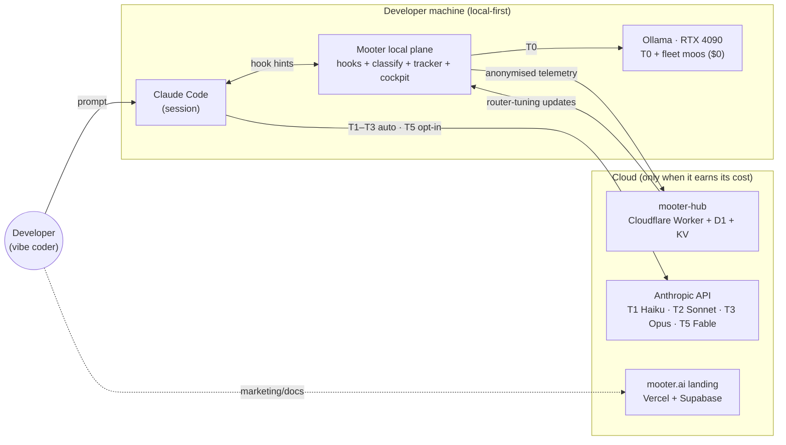
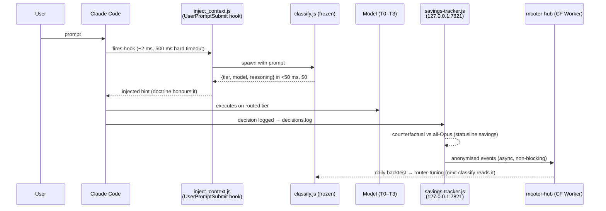

# Mooter — System Design

**Status:** canonical ecosystem map · v2 · 2026-07-06
**Scope:** the whole system — engine, cockpit, hub, fleet, learning, product bets, roadmap, risks.
**Rule:** this doc *ties together and points*; it does not duplicate. Depth lives in
[`ARCHITECTURE.md`](../../ARCHITECTURE.md) (core router, source of truth),
[`docs/strategy/ARCHITECTURE_V4.md`](../strategy/ARCHITECTURE_V4.md) / [`V5`](../strategy/ARCHITECTURE_V5.md) (layers),
[`docs/strategy/MOOTER_ROADMAP.md`](../strategy/MOOTER_ROADMAP.md) (waves/squads),
[`docs/strategy/FLOWCHART.md`](../strategy/FLOWCHART.md) (decision pipeline),
[`INFRA.md`](../../INFRA.md) (endpoints) and [`docs/adr/`](../adr/) (decisions).
If code disagrees with this doc, **the code wins** — open an issue.

---

## 0. Executive summary (read this if you read nothing else)

**Mission:** *"Your LLM router. Local-first. Learns forever."* (decided 2026-06-07)

**The problem.** Developers on $100+/month AI subscriptions route *everything* to the most
expensive model — including work a free local model handles. Nobody tells them what they
actually got for the money.

**The bet (positioning, deliberately narrow).** Mooter is **not** an API proxy competing
with LiteLLM/OpenRouter. It is the **cost control plane for the solo dev / vibe coder**:
a deterministic classifier decides the minimum viable tier for every prompt in <50 ms at
$0, a local GPU absorbs everything it can, every saving is **proved counterfactually**
(vs all-Opus), and the system improves itself with a fleet of $0 local agents ("moos").

**The soul** (why this exists beyond savings): give a non-dev creative the power of
Claude Code **without the operational burden** — perfect handoffs, auditable memory,
GPU as free workforce. The founder is the target user.

**Honest, dated numbers** (sources in §12; nothing extrapolated):

| Metric | Value | Date / source |
|---|---|---|
| "Mooter audited Mooter" real session | $2.04 vs $11.78 counterfactual = **82.7% saved** | 2026-06-06 |
| Live dashboard | $25.95 saved / 658 calls (47%) | 2026-06-08 |
| Statusline (real day) | 🐮 saved $2.51 today, 84% vs all-Opus · **70% of turns local** | 2026-06 |
| Classification | <50 ms p50 · hook p50 113 ms / p95 407 ms · $0 per decision | 2026-05 |
| Pastor Wave 1 | recall 100% · p99 3.74 ms | 2026-05-27 |
| Workflow engine demo (25 agents) | real cost **$0.0028** (160× under estimate) | 2026-06-07 |
| Realistic savings envelope | **65–82%** vs all-Opus (not the 95% blogs promise) | FLOWCHART.md §0 |
| Routing benchmark (adversarial) | in-domain COMPETITIVE · OOD DOMINATED · risk-axis BEST | 2026-05-24 tri-axis |

**Moats (as claimed in the founder's vault, `10-projects/mooter`):** private
dataset of real routing decisions; evolving tuning state; codified judgement (the doctrine
*is* the product); the internal ecosystem (Cloude Home / Speaker) as first customers; and
now the **$0 self-improvement fleet** on owned hardware.

**Stage:** OSS (MIT), building in the open, pre-distribution. The biggest gap is not
technology — it is **launch execution** (§11, R1).

---

## 1. System context (C4 Level 1)

Design principles (full text in `ARCHITECTURE.md §1`): **no proxy** (Mooter only emits
hints; if it dies, Claude Code still works), **zero LLM cost to classify**, **doctrine >
configuration**, **explainability non-negotiable**, **optimisation never overrides the
doctrine** (dual-enforced).

**The operational quartet** (how the founder actually runs this, and the product thesis
in miniature): Cowork (design, rare) · Claude Code (irreversible work) · **local moos
($0 workforce)** · Mooter (the conductor). Roadmap rule: *maximum speed = maximum
delegation to local.*

---

## 2. Tier ladder (the truth, no embellishment)

| Tier | Model | Routing | Enforced where |
|---|---|---|---|
| T0 | local Ollama (qwen3:30b et al.) | auto | `tools/router/classify.js` |
| T1 | Haiku | auto | idem |
| T2 | Sonnet | auto | idem |
| T3 | Opus | auto · **high-risk floors force T3** (deploy/secrets/migrations/push/prod) | classify.js + doctrine (dual-enforce, `ARCHITECTURE.md §10`) |
| T5 | Fable | **opt-in only via `@fable`** — never auto-routed; there is no T4 | `packages/router/src/fable-5-routing.ts` |

**Hard invariant:** `tools/router/classify.js` is FROZEN — sha256
`427d8c0b516315c6a858b183892ec26dc0fed7b52f11000e1e6b81fd364bc48f`, CI-enforced.
Learning happens *around* it (tuning state, within-tier selection), never *inside* it.

---

## 3. Runtime flow — one prompt, end to end

Failure modes and budgets: `ARCHITECTURE.md §12–13`. Key property: every arrow above is
**fail-open** — hub down, tracker down, or Ollama cold never blocks the session.

---

## 4. Component map (C4 Level 2 — containers, real paths)

| # | Component | Path | Tech | Talks to |
|---|---|---|---|---|
| 1 | Classifier (frozen) | `tools/router/classify.js` | Node, pure regex | invoked by hook; reads router-tuning |
| 2 | Hook | `tools/router/inject_context.js` | Node, UserPromptSubmit | spawns #1, injects hint into CC |
| 3 | Savings tracker | `tools/router/savings-tracker.js` | Node daemon, HTTP `127.0.0.1:7821` (`MOOTER_TRACKER_PORT`), single-instance | serves `/metrics` to #6 and #8; feeds statusline · v0.8.0 Host/Origin/CSRF guard staged (SYNC.md §SECURITY-1) |
| 4 | Router engine (waves 28–34.5 frozen; wave 58 additions) | `packages/router/src/` | TypeScript | `specialization-matrix.ts`, `decide-agent.ts`, `task-categories.ts`, `adaptive-learner.ts`, `tes-calculator.ts`, `benchmark-fetcher.ts`, `fable-5-routing.ts` — **within-tier** model/agent selection *after* the tier is chosen |
| 5 | CLI | `packages/cli/` | Node (`mooter …`) | init/audit/wave/pastor commands; scaffold gates |
| 6 | Cockpit | `packages/vscode-extension/` (`mooter-cockpit`, 0.16.x) | VS Code webview | polls #3 `:7821`; Live Preview iframes local dev server; session/fleet lenses |
| 7 | Hub | `hub/` (`wrangler.mooter.toml`, Worker `mooter-hub`) | Cloudflare Worker + D1 + KV | 21 routes (`events` `delta` `stats` `benchmarks` `pricing` `pastor-v2` `pastor-adapters` `federated` `transparency` `heartbeat` `live_sessions` `user-dashboard` `version` `wave-status` `workflows` `feedback` `models` `admin_*`) · 4 cron jobs (`aggregate` `generate` `notify` `update-profiles`) |
| 8 | MCP server | `packages/mcp-server/` | MCP stdio, 20 tools (`src/tools.ts`) | exposes routing/savings/pastor to Claude Desktop/Cowork; reads #3 |
| 9 | Fleet plane | `packages/fleet-commander/`, `spawn-orchestrator/`, `sessions-orchestrator/`, `worktree-conductor/`, `overclock-moo/` + `_handoff/fleet/fleet-orchestrator.mjs` | Node + Agent SDK | spawns local moos on the 4090; 1 pillar = 1 worktree; state in `_handoff/fleet/*/STATE.json`; caps in `fleet.json` |
| 10 | Pastor (learning, Eixo 2/3) | `packages/router/src/adapter/` + `docs/strategy/PASTOR.md` | TF-IDF deterministic, LoRA forge | trains on decision journals; serves via hub `pastor-v2` |
| 11 | Landing | `landing/` | Next.js on Vercel (mooter.ai) | marketing; Supabase auth; install via `irm https://mooter.ai/install.ps1` |
| 12 | Bridge | `packages/mooter-bridge/` | MCP stdio | Cowork ⇄ Mooter sessions (P0/P1; hardening pending) |

Other packages (`council`, `effort`, `synthesis`, `transparency`, `validation`,
`workflow`, `arbitrage-monitor`, `minimax-watcher`, `mooter-bench`, `turboquant-backend`,
`vllm-backend`, `data-rights`): standalone engine/aux packages — one line each in
`docs/strategy/MOOTER_ARCHITECTURE.md`.

### 4.1 The layer stack (L0–L16)

The routing brain is organised as 17 conceptual layers. Depth:
[`ARCHITECTURE_V4.md`](../strategy/ARCHITECTURE_V4.md) (L0–L11) and
[`ARCHITECTURE_V5.md`](../strategy/ARCHITECTURE_V5.md) (L12–L16).

| Range | Layers |
|---|---|
| L0–L6 | cache · guardrails · features · kNN · confidence · dispatch · cascade |
| L7–L11 | personalisation · fingerprint · skill graph · arbitrage · federated |
| L12–L16 | LLMLingua compression (opt-in) · LoRA hot-swap · Setup Intelligence · Ecosystem Awareness · Prompt-Quality Intelligence |

Numbering note: V4's "Layer X" (telemetry) was absorbed by L16 (`ARCHITECTURE_V5.md §3`).

---

## 5. Data stores (what is persisted, where, and why)

| Store | Location | Written by | Read by |
|---|---|---|---|
| Decision journal | `~/.claude/tools/router/decisions.log` (`ROUTER_DIR` in `inject_context.js`) | hook per turn | backtest, Pastor, cockpit |
| Router tuning state | `~/.claude/tools/router/` (mirror of repo, synced by `/mooter-update` + `sync-hooks.js`) | releases | classify.js at runtime |
| Preferences | `~/.mooter/preferences.json` (**not** `~/.claude/`) | user | statusline, cockpit |
| Cost-perf outcomes | `~/.mooter/cost-perf-log.jsonl` | execution outcomes | `adaptive-learner.ts` |
| Adaptive matrix (learned cells) | `~/.mooter/specialization-overrides.json` — cells empty by default, learned only after ≥5 real outcomes (EWMA) | `adaptive-learner.ts` | `decide-agent.ts` |
| Community aggregate | hub D1 (+ KV cache) | hub `events`/`aggregate` | daily backtest |
| Fleet state | `_handoff/fleet/*/STATE.json` + `fleet-ledger.jsonl` + `fleet-heartbeat.json` | orchestrator | conductor, cockpit, cronista |

Privacy posture: telemetry is anonymised and async; local-first means the session never
depends on the cloud. Details: `PRIVACY.md`, `SECURITY.md`, `ARCHITECTURE.md §14`.

---

## 6. Learning loops (three, deliberately separate)

1. **Local, per-user** — `adaptive-learner.ts` EWMA over real outcomes; only fills
   within-tier choices; can never cross the doctrine floors.
2. **Community** — hub aggregates deltas daily → new router-tuning → every install picks
   it up on the next classify call. Non-blocking, fail-open.
3. **Pastor (specialisation)** — deterministic TF-IDF priors + LoRA adapter forge
   (Eixo 3) trained on decision journals; distributed via hub `pastor-v2`.

The invariant across all three: **learning may only move work *down* the ladder or
sideways; the high-risk floors and the frozen classifier are untouchable.**

---

## 7. The pillar map — the self-improvement fleet (12 + 1)

The fleet is the fourth member of the quartet: local moos on the 4090, running bounded
rounds per pillar at $0, governed by `_handoff/fleet/fleet.json` caps
(GPU-heavy concurrency 1 · cloud 2 · pool 4 · $5/day budget · per-pillar day quotas)
and a human gate on anything irreversible. Full charters + execution order:
[`_handoff/FLEET_FASE3_LAUNCH_HANDOFF.md`](../../_handoff/FLEET_FASE3_LAUNCH_HANDOFF.md).

| Pillar | Squad | Charter (1 line) | Measured success criterion |
|---|---|---|---|
| **council** 🔥F3 | 🧠 Auto-Evolution | council quality + calibration (length-neutral, ACT, cost) without regression | oracle_gap ≤5% · p99 ≤100 ms |
| **seguranca** 🔥F3 | 🛡️ Security | continuous 3-promises audit + packs/MCP supply-chain | 0 leaks · audit 100% |
| **cronista** 🔥F3 (13th, meta) | 📊 Obs | scribe/QA: record everything, cross-pillar harmony, pre-cook handoffs; archive proposals via DECISIONS.md (two-factor) | digest ≤1 round behind · 0 unreported incoherences |
| bench-eval | 📊 Obs | honest OOD eval of the full runtime + fix pre-existing `moo-verify` failure | ROUTER_SCORE per round · moo-verify green |
| matriz | 🧭 Routing | tune specialization-matrix vs local oracle + route subagent tasks to local (37% of real burn) | measured acc delta · cloud tokens avoided/round |
| quantizacao | 🧭 Routing | AWQ/quant candidates vs qwen3:30b base | tok/s gain with no measured quality loss |
| integracoes-llm | 🧭 Routing | local draft→cloud verify bench + MCP result distiller (24% of burn) | lossless speedup · MCP tokens avoided |
| lora-dora | 🧠 Auto-Evolution | 1 real adapter (O-LoRA/DoRA, anti-forgetting) | adapter passes forge gate |
| vscode-plugin | 🛩️ Cockpit | additive micro-polish via `COCKPIT_UX_AUDIT` + Context Guardian as user feature (66% of burn = ctx >150k) | 0 dead buttons · tests green |
| design | 🛩️ Cockpit | kill hardcoded colours → `var(--vscode-*)` (pre-cooks Deck Fase 0) | 0 hex in touched CSS · 3 themes legible |
| statusline | 🛩️ Cockpit | honest opt-in chips without touching default | default byte-identical |
| site | 📦 Distribution | Install-Ready + fresh rankings + educational onboarding | Lighthouse ≥95 · install E2E |

**Fleet honesty note (2026-07-06):** foundation (orchestrator, Overclock pool, 12 scaffolds)
is **in main, git-proven** — but all previous rounds were `DRY_RUN`; the real local-workforce
runner is what FASE3 builds. Governance: AUTO for reversible, DIGEST for review,
two-factor for destructive.

---

## 8. Product surfaces & bets in flight

Where the engine becomes something a vibe coder *sees*. Each bet has a spec in `_handoff/`.

| Bet | What it is | Status (2026-07-06) | Spec |
|---|---|---|---|
| **Live Preview** (W16) | Lovable-grade App Stage inside VS Code — iframe to the *real local dev server* (no WebContainers), Director's Cut event feed | ✅ MP2+MP4 in prod (`main 266e4f3`); hot-reload E2E pending | `_handoff/LIVE_PREVIEW_SUPER_MASTERPROMPT.md` |
| **Live Edit MP5** | select-to-edit: element/area selection + inline prompt + model chip (router-native) + deterministic $0 edits | 🔥 running in cloud CC now | `_handoff/LIVE_EDIT_MP5_SPEC.md` |
| **CTO Command Deck** (W15) | cockpit redesign: exception inbox + 4 diagnostic lenses (Floor/Flow/Economics/Memory) + 🧠 Cowork lens | 🔜 6-phase masterprompt ready | `_handoff/CTO_COMMAND_DECK_SPEC.md` |
| **Mooter Mirror** | Cowork brain mirrored read-only in the cockpit (memory lives on disk — no connector needed) | 🔜 3 masterprompts ready | `_handoff/MOOTER_MIRROR_ARCHITECTURE.md` |
| **Conductor** | orchestrate the CC session fleet — route masterprompts to the right worktree/session, $0 dispatch | 🔜 brief (Nível 1 Dispatch MVP) | `_handoff/MOOTER_CONDUCTOR_BRIEF.md` |
| **Moove** | assisted migration Lovable → CC+Mooter ("iPhone→Samsung") as GTM funnel; never touch secrets, no perfection promises | 🔜 brief + market research done | Notion → Moove page |
| **Overclock Moo** | GPU saturation button — concurrent local pool + thermal clamp | ✅ pool in main; Fase 2 (A/B benchmark + live card) pending | Notion backlog |
| **Quota-Aware Routing** (MP-Q) | routing reacts to weekly subscription quota (weekly at 89% triggered it) | 🔜 recommended FIRST in exec order | `_handoff/QUOTA_AWARE_MP.md` |

---

## 9. Current state snapshot (2026-07-06)

| Front | State | Evidence |
|---|---|---|
| Engine/router | ✅ prod, frozen, waves 26–34.5 shipped | tags v1.15.0 → v1.21.0 line |
| Value proof | ✅ measured (see §0 table) | audit 82.7% · dashboard 47% · 70% local |
| Cockpit | 🟡 0.16.x installed locally; **Marketplace publish = W3, not done** | Notion backlog |
| Live Preview | ✅ MP2+MP4 in prod · MP5 in flight | `main 266e4f3` |
| Fleet | 🔜 FASE3 ready to launch (council+seguranca+cronista); 0 real rounds yet | FLEET_FASE3 handoff v4 |
| Security | 🟡 tracker v0.8.0 guard + pack auditor **staged, pending CC tests + selective commit** | SYNC.md §SECURITY-1/2 |
| Distribution | ❌ never publicly launched; First-Magic Onboarding (<5 min) is P0 backlog | Notion backlog |
| Status history | gate 2026-05-26 missed **by non-execution of launch, not lack of traction** → pivot → reverted by Day II execution → `active-primary-focus` formalised 2026-07-06 | vault `10-projects/mooter` |

### Backlog highlights (Notion "Mooter Backlog", open items)

First-Magic Onboarding (<5 min for non-devs) · publish cockpit to VS Code Marketplace ·
reposition hero "router-that-saves → **control plane of the fleet**" · Moove GTM funnel ·
Live Edit MP5.2 (Select-Lock + anchored prompt + AST fence) · Mission Control dedicated tab ·
"GPU always saturated" policy · QA-funnel (local 24/7 → deterministic gates → cloud QA only
on candidates → human gate) · cross-machine PC↔Mac sync via hub · Cockpit Doctor & Self-Heal.

---

## 10. Roadmap (v3, 8 squads — full table in `MOOTER_ROADMAP.md`)

Priorities: performance/cost first · leverage · $0 local speed · proof > promise ·
**land > start** (WIP down is rule #1).

| Phase | Waves | Theme |
|---|---|---|
| **NOW (P0)** | W1 ✅ · W13 🟡 · W15 🔜 · W14 🟡 · W2 🔜 · W3 🔜 | land polish, Delivery Cockpit, CTO Deck, comms protocol, housekeeping, **distribution** |
| **NEXT (P1)** | W5 · W4 · W9 · W7 · W6 · W16 | Moo Loop Sessions, Evolution Fleet F1, gradient-free TTL, Adapter Forge, Budget Cockpit, Live Preview build-cinema |
| **FRONTIER (P2)** | W11 · W8 · W10 · W12 | router bandit + AWQ, edge-cloud speculative decoding, graph routing, differential privacy |

Squad model (Team Topologies): 🧭 Routing & Inference · 🧠 Auto-Evolution · 🛩️ Cockpit & UX ·
📦 Site & Distribution · ⚙️ Platform & Data · 🔀 Agent Comms · 🛡️ Security & Privacy ·
📊 Observability. Each squad = founder + moos + CC on one front.

---

## 11. Risks & honest gaps (the part an investor should stress-test)

| # | Risk | Evidence | Mitigation in motion |
|---|---|---|---|
| R1 | **Distribution debt** — product shipped 30+ waves, never launched publicly; gate 2026-05-26 missed by non-execution | vault status history | W3 is P0; First-Magic Onboarding; Moove as funnel |
| R2 | **OOD weakness** — benchmark verdict: dominated out-of-domain (generalist routing) | tri-axis 2026-05-24 | positioning doubles down on niche (coding, risk-axis BEST); bench-eval pillar runs honest OOD continuously |
| R3 | **Bus factor = 1** — solo founder, non-dev background, AI-leveraged | — | radical documentation discipline (this doc, ADRs, 4 canónicos); fleet automates maintenance |
| R4 | **Fleet is promise until rounds are real** — all history is DRY_RUN | fleet-heartbeat.json | FASE3 builds the real local runner; success criteria are measured, not vibes |
| R5 | **Security hardening staged but not merged** (tracker CSRF guard, pack auditor) | SYNC.md §SECURITY-1/2 | checklist ready for CC; supply-chain F1/F2/F3 need a dedicated wave (frozen files) |
| R6 | **Windows/mount fragility** — mount git state unreliable; past NUL-corruption incident | SYNC.md 2026-06-23 recovery | rule: read via mount only cross-checked; git writes always native |
| R7 | **Anthropic dependency** — T1–T3/T5 are one vendor | — | multi-provider is designed (strategy v2: Gemini/Codex/OpenAI wrappers exist); local T0 is vendor-free |
| R8 | **Change ≠ improvement** — council shipped with gates PASS but no quality eval | memory 2026-06-22 | council pillar charter is exactly this eval; eval harness Fridays |

---

## 12. Where the evidence lives

| Claim | Source |
|---|---|
| 82.7% saved real session | Notion HQ "Mooter audited Mooter" (2026-06-06) + decisions.log |
| Dashboard $25.95 / 658 calls / 47% | Wave 32 validation (2026-06-08), hub endpoints live |
| Pastor recall 100% · p99 3.74 ms | `docs/benchmarks/wave1-pastor` (2026-05-27) |
| Tri-axis benchmark verdict | vault `30-learnings/mooter-value-benchmark-2026-05-24` (frozen HEAD `ce08f72c`; publish pending) |
| $0.0028 workflow demo | Wave 28 (2026-06-07, tag `v1.16.0-workflow-engine-mvp`) |
| 65–82% envelope + TTFT table | `docs/strategy/FLOWCHART.md` §0/§2 |
| Fleet foundation in main | `_handoff/FLEET_FASE3_LAUNCH_HANDOFF.md` git confrontation table |

---

## 13. Deployment topology

| Plane | Runs on | Deploy path |
|---|---|---|
| Local plane (hook, classify, tracker, cockpit, moos) | dev machine (Win11 + RTX 4090 reference) | `npm`/`vsce` + `/mooter-update` (mirrors to `~/.claude/`) |
| Hub | Cloudflare Workers (`mooter-hub`) | `wrangler deploy -c wrangler.mooter.toml` (⚠️ `frugal-hub` is frozen legacy) |
| Landing | Vercel | git push → Vercel CI |
| Auth/data (landing) | Supabase | MCP/migrations |

IDs, tokens and exact endpoints: `INFRA.md` (never duplicated here).

---

## 14. Key trade-offs (interview-grade answers)

| Decision | Trade-off accepted | Why | Record |
|---|---|---|---|
| Regex classifier, frozen | less "smart" than LLM/embedding routing | deterministic, <50 ms, $0, auditable; an LLM routing LLMs is recursive cost | `ARCHITECTURE.md §15` |
| Hints, not proxy | can't force a model | zero added failure surface; CC works if Mooter dies | `ARCHITECTURE.md §1` |
| Local-first T0 | TTFT ~4.6 s cold vs 0.7 s Haiku | $0 and wins on long outputs; `OLLAMA_KEEP_ALIVE=24h` mandatory | `FLOWCHART.md §0` |
| Doctrine floors dual-enforced | forgoes some savings | push/deploy/secrets are asymmetric-risk | `ARCHITECTURE.md §10` |
| T5 opt-in only | no auto access to strongest model | cost control + explicit human intent | `CLAUDE.md` tier ladder |
| Hub async, fail-open | learning lags up to a day | session latency is sacred | `ARCHITECTURE.md §12` |
| Fleet capped ($5/day, quotas, human gate) | slower autonomous progress | autonomy without governance is how repos die; two-factor on destructive | `fleet.json` + AUTONOMY_MODEL.md |
| Niche (solo dev cost control) over proxy market | smaller initial TAM | LiteLLM/OpenRouter own the proxy game; nobody owns this niche; founder is the user | vault `mooter-strategy-v2` |

Full ADRs: [`docs/adr/`](../adr/) (015–020, W3-001). Glossary:
[`docs/strategy/GLOSSARY.md`](../strategy/GLOSSARY.md).

---

## 15. How to keep this doc honest

- Change a component's path/port/contract → update the row here in the same PR.
- New subsystem or pillar → one row in §4/§7 + one arrow in §1; depth goes in its own doc.
- New measured number → add to §0/§12 **with date and source**; never replace an old
  number silently — supersede it.
- Never paste credentials, shas of convenience, or numbers you didn't measure.
