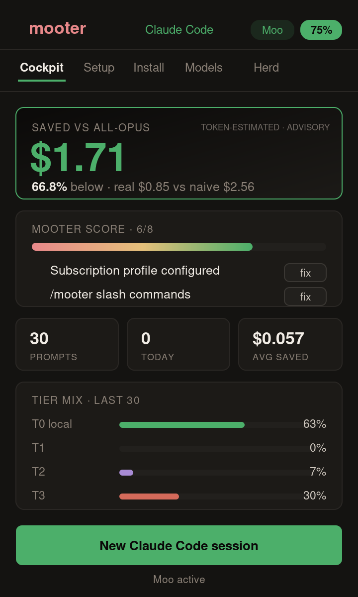

# 🐮 Mooter — AI Project Cockpit for VS Code

**Operate a Claude Code project from one cockpit.** Resume session context, plan work, see local-first routing, watch agents and Live Preview, and review guarded changes before publishing. The deterministic engine is the moat; the VS Code cockpit is the product.

> Community project. **Not affiliated with, or endorsed by, Anthropic.** "Claude" and "Claude Code" are trademarks of Anthropic, PBC. This extension pairs with — and never replaces — the official Claude Code extension.

## Features

| | |
|---|---|
| ↩ **Resume** | See recent Claude Code sessions, their repository state, pending asks, and deterministic handoffs. Missing evidence stays `n/d`. |
| 🗺️ **Plan** | Project Command shows roadmap waves, dependencies, WIP, gates, and available forecast evidence. |
| 🔀 **Route** | Inspect tier mix, model, confidence, escalation rule, and counterfactual savings from local router telemetry. |
| 🎬 **Watch** | Follow agents and sessions in Mission Control, and inspect the running app through Live Preview. |
| 🛡️ **Review** | Preview deterministic edits, keep or revert Agent SDK changes, run Security Review, and move approved bytes through Git and Vercel gates. |
| 🩺 **Setup & Doctor** | Check engine, tracker, models, and pipeline health with explicit recovery actions. |

## Requirements

- The **Mooter engine** — install once with `npx @mooter/cli` (see [mooter.ai](https://mooter.ai)).
- The official **[Claude Code extension](https://marketplace.visualstudio.com/items?itemName=anthropic.claude-code)** (recommended for sessions and pairing).
- Optional: **[Ollama](https://ollama.com)** for the local T0 tier.
- Optional: the workspace's **Claude Agent SDK** for cloud-assisted Live Edit.
- Optional: a Git remote and authenticated **Vercel CLI** for Commit + Push and production deploy.

Until the engine is installed, the cockpit shows a short setup wizard instead of data.

## How it works

Mooter has two layers. The local engine uses Claude Code hooks to make deterministic routing decisions and record telemetry; it is not an API proxy. The VS Code cockpit reads that evidence, and it can also act on the workspace when you choose Live Edit, a Security fix, handoff, Commit + Push, or deploy.

Live Preview binds edits to a confirmed served-tree/origin lease. Deterministic edits show a diff and recheck the source hash before writing; Agent SDK edits require Workspace Trust and return for keep/revert review. Undo and revert refuse stale bytes. Publish requires accepted changes and a current Security Review, commits only approved paths, never force-pushes, and deploys an immutable pushed commit only after the Vercel project name is confirmed.

## Privacy

No Mooter account or analytics. The extension is not network-isolated: it talks to localhost for tracker and preview; when configured, its sync collector reads Notion page metadata; explicit actions may use the authenticated local `gh` CLI, the workspace's Agent SDK, Git remotes, and the user's Vercel CLI.

In Restricted Mode, telemetry views remain available while Agent SDK and dev-server execution stay disabled. Deterministic local edit controls can still modify workspace files through their preview, tree-lease, and source-hash gates. Virtual/web workspaces are unsupported because the cockpit needs local filesystem and CLI access.

## Settings

- `mooter.trackerPort` — port of the local savings tracker (default `7821`).
- `mooter.statusBar.enabled` — show the 🐮 status-bar item (default `true`).

## Cross-platform

macOS, Windows and Linux. With Remote/WSL/Codespaces the extension runs where your router lives (`extensionKind: workspace`).

MIT licensed · [source](https://github.com/pauloloureiroshp-ship-it/mooter) · [issues](https://github.com/pauloloureiroshp-ship-it/mooter/issues)
